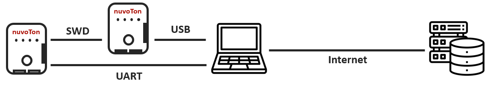
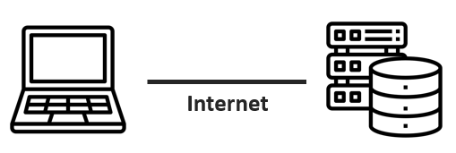
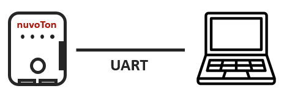
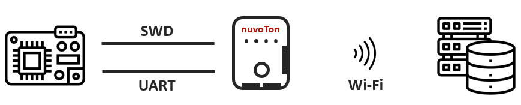
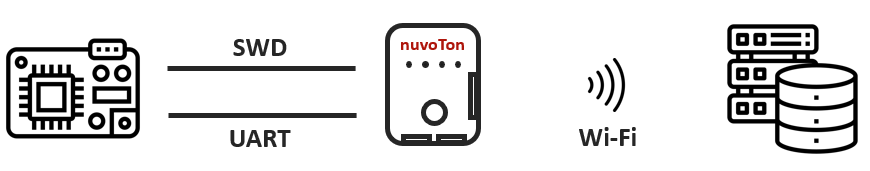
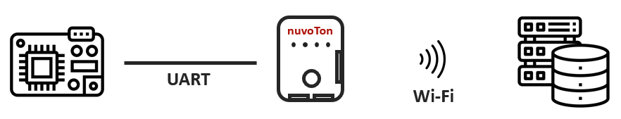

# Flow

## Manufacturing

### Prepare programmer

* Generate a private key inside the programmer
* Provision certificate to the programmer
* Program signed firmware to the programmer
* Key exchange between a programmer and cloud server
    * Compute a shared key

### Export package

* Upload firmware for target boards to cloud server
* Cloud server encrypts package information with shared key
    * The resulting cipher text (package) can be downloaded to OEM’s PC.
    It can then be sent to CM.

### Import package

* Import the cipher text (package) to the programmer
* The package information is stored in the flash of the programmer
    * Production limit (over-production protection)
    * Token (for downloading signed firmware)

### Device authentication provisioning

* Register a target board on the cloud server
* Generate a private key inside the target board
* Provision certificate to the target board

### Firmware provisioning

* Ask server to create keypairs for secure boot on target board
* Program public keys for secure boot to target board
* Signed firmware is transmitted to programmer over HTTPS.
* Program bootloader firmware(BL2) to target board via SWD
* Securely program app firmware(BL3) to target board via ISP UART

## Maintenance

### Firmware upgrade

* The server checks if the version number of firmware
  is greater than that of the target board.
* Signed firmware is transmitted to programmer over HTTPS.
* Securely program app firmware(BL3) to target board via ISP UART

