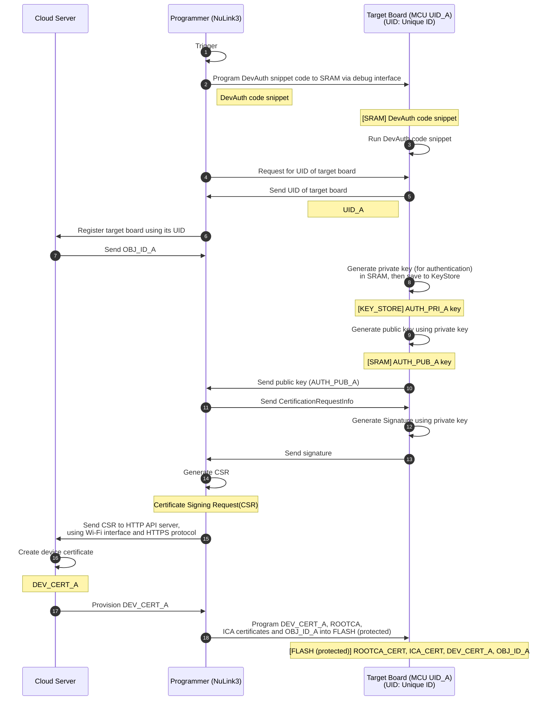

---
hide:
  - toc
---

# Device provisioning authentication

```mermaid
sequenceDiagram
    autonumber
    participant c as Cloud Server
    participant a as Programmer (NuLink3)
    participant t as Target Board (MCU UID_A)<br/> (UID: Unique ID)
    a ->> a : Trigger
    a ->> t : Program DevAuth snippet code to SRAM via debug interface 
    Note right of a: DevAuth code snippet
    Note over t: [SRAM] DevAuth code snippet 
    t ->> t : Run DevAuth code snippet
    a ->> t : Request for UID of target board
    t ->> a : Send UID of target board
    Note left of t: UID_A
    a ->> c : Register target board using its UID
    c ->> a : Send OBJ_ID_A  
    t ->> t : Generate private key (for authentication) <br/> in SRAM, then save to KeyStore
    Note over t: [KEY_STORE] AUTH_PRI_A key
    t ->> t : Generate public key using private key
    Note over t: [SRAM] AUTH_PUB_A key
    t ->> a : Send public key (AUTH_PUB_A)
    a ->> t : Send CertificationRequestInfo    
    t ->> t : Generate Signature using private key
    t ->> a : Send signature
    a ->> a : Generate CSR
    Note over a: Certificate Signing Request(CSR)
    a ->> c : Send CSR to HTTP API server, <br/> using Wi-Fi interface and HTTPS protocol
    c ->> c : Create device certificate
    Note over c: DEV_CERT_A
    c ->> a : Provision DEV_CERT_A
    a ->> t : Program DEV_CERT_A, ROOTCA, <br/> ICA certificates and OBJ_ID_A into FLASH (protected)
    %% {TODO} a ->> t : Provision DEV_CERT_A, ROOTCA, ICA certificate into OTP memory <br/>OBJ_ID_A into FLASH (protected)
    %% {TODO} Note over t: [OTP_MEMORY] ROOTCA_CERT, ICA_CERT, DEV_CERT_A (HASH)
    Note over t: [FLASH (protected)] ROOTCA_CERT, ICA_CERT, DEV_CERT_A, OBJ_ID_A
```