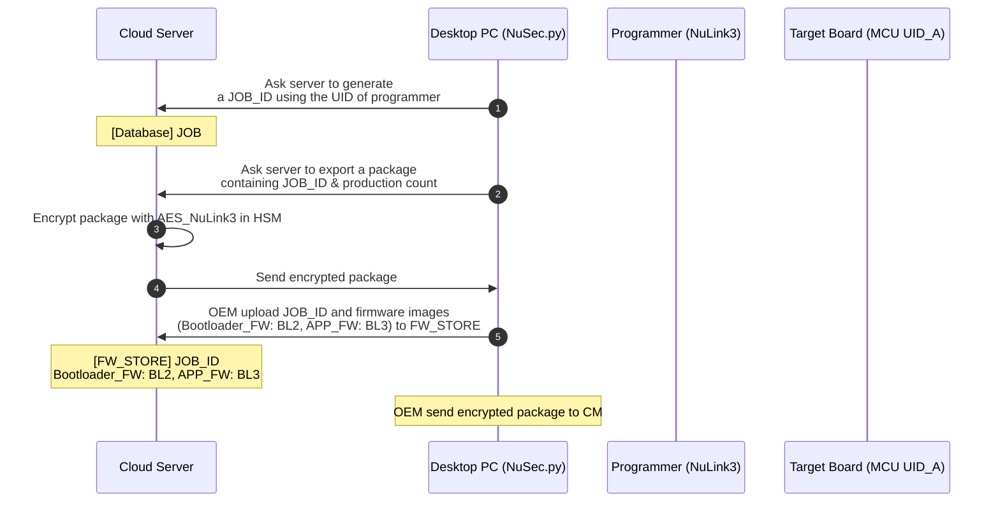

---
hide:
  - toc
---

# Export Package

```mermaid
sequenceDiagram
    autonumber
	participant c as Cloud Server
	participant d as Desktop PC (NuSec.py)
	participant a as Programmer (NuLink3)
	participant t as Target Board (MCU UID_A)

    d ->> c: Ask server to generate <br/> a JOB_ID using the UID of programmer
    note over c: [Database] JOB
    d ->> c: Ask server to export a package <br/> containing JOB_ID & production count
    c ->> c: Encrypt package with AES_NuLink3 in HSM
    c ->> d: Send encrypted package
    d ->> c: OEM upload JOB_ID and firmware images <br/> (Bootloader_FW: BL2, APP_FW: BL3) to FW_STORE
    note over c: [FW_STORE] JOB_ID <br/>Bootloader_FW: BL2, APP_FW: BL3
    
    note over d: OEM send encrypted package to CM
```