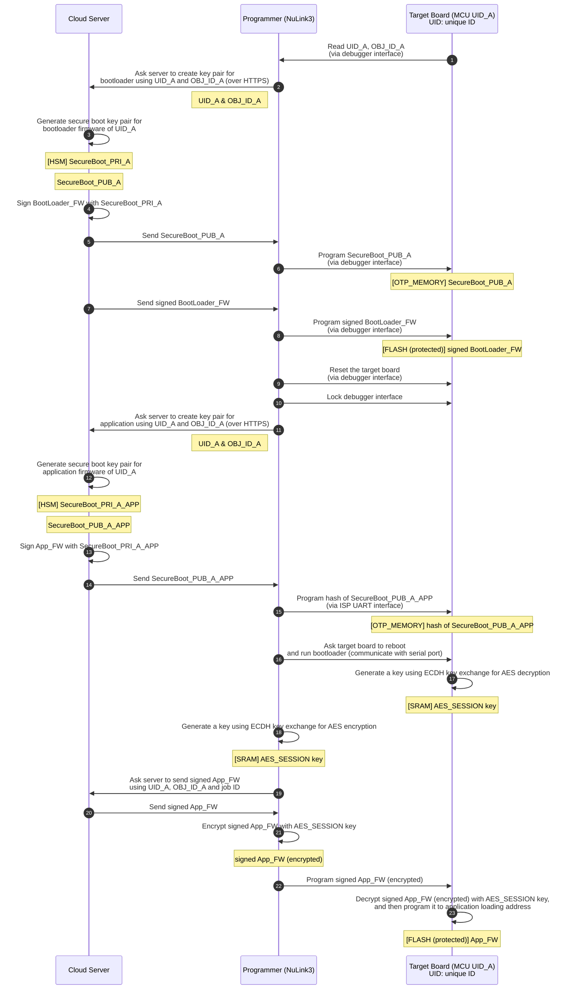

---
hide:
  - toc
---

# Firmware provisioning

```mermaid
sequenceDiagram
    autonumber
    participant c as Cloud Server
    participant a as Programmer (NuLink3)
    participant t as Target Board (MCU UID_A) <br/>UID: unique ID

    t ->> a : Read UID_A, OBJ_ID_A <br/> (via debugger interface)
    a ->> c : Ask server to create key pair for <br/> bootloader using UID_A and OBJ_ID_A (over HTTPS)
    Note left of a : UID_A & OBJ_ID_A
    c ->> c : Generate secure boot key pair for <br/> bootloader firmware of UID_A
    Note over c : [HSM] SecureBoot_PRI_A
    Note over c : SecureBoot_PUB_A
    c ->> c : Sign BootLoader_FW with SecureBoot_PRI_A
    c ->> a : Send SecureBoot_PUB_A
    a ->> t : Program SecureBoot_PUB_A <br/> (via debugger interface)
    Note over t: [OTP_MEMORY] SecureBoot_PUB_A
    c ->> a : Send signed BootLoader_FW
    a ->> t : Program signed BootLoader_FW <br/>(via debugger interface)
    Note over t: [FLASH (protected)] signed BootLoader_FW
    a ->> t : Reset the target board <br/>(via debugger interface)

    a ->> t : Lock debugger interface

    a ->> c : Ask server to create key pair for <br/> application using UID_A and OBJ_ID_A (over HTTPS)
    Note left of a : UID_A & OBJ_ID_A
    c ->> c : Generate secure boot key pair for <br/> application firmware of UID_A
    Note over c : [HSM] SecureBoot_PRI_A_APP
    Note over c : SecureBoot_PUB_A_APP
    c ->> c : Sign App_FW with SecureBoot_PRI_A_APP
    c ->> a : Send SecureBoot_PUB_A_APP
    a ->> t : Program hash of SecureBoot_PUB_A_APP <br/> (via ISP UART interface)
    Note over t: [OTP_MEMORY] hash of SecureBoot_PUB_A_APP
    a ->> t : Ask target board to reboot <br/> and run bootloader (communicate with serial port)

    %% ECDH
    t ->> t: Generate a key using ECDH key exchange for AES decryption
    Note over t: [SRAM] AES_SESSION key
    a ->> a: Generate a key using ECDH key exchange for AES encryption
    Note over a: [SRAM] AES_SESSION key

    a ->> c: Ask server to send signed App_FW <br/> using UID_A, OBJ_ID_A and job ID
    c ->> a: Send signed App_FW
    a ->> a: Encrypt signed App_FW with AES_SESSION key
    Note over a: signed App_FW (encrypted)
    a ->> t: Program signed App_FW (encrypted)
    t ->> t: Decrypt signed App_FW (encrypted) with AES_SESSION key, <br/> and then program it to application loading address
    Note over t: [FLASH (protected)] App_FW

```
