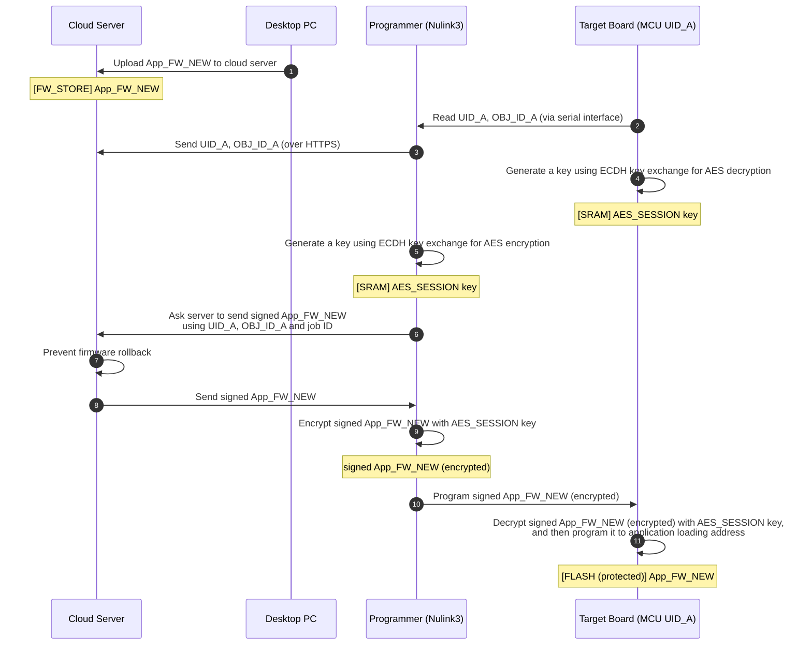

---
hide:
  - toc
---

# Firmware upgrade

```mermaid
sequenceDiagram
    autonumber
    participant c as Cloud Server
    participant d as Desktop PC
    participant a as Programmer (Nulink3)
    participant t as Target Board (MCU UID_A)

    d ->> c : Upload App_FW_NEW to cloud server
    Note over c: [FW_STORE] App_FW_NEW
    t ->> a : Read UID_A, OBJ_ID_A (via serial interface)
    a ->> c : Send UID_A, OBJ_ID_A (over HTTPS)

    %% ECDH
    t ->> t: Generate a key using ECDH key exchange for AES decryption
    Note over t: [SRAM] AES_SESSION key
    a ->> a: Generate a key using ECDH key exchange for AES encryption
    Note over a: [SRAM] AES_SESSION key

    %% t ->> a: Authenticate DEV_CERT_A with RootCA & ICA Certificate
    a ->> c: Ask server to send signed App_FW_NEW <br/> using UID_A, OBJ_ID_A and job ID
    c ->> c: Prevent firmware rollback
    c ->> a: Send signed App_FW_NEW
    a ->> a: Encrypt signed App_FW_NEW with AES_SESSION key
    Note over a: signed App_FW_NEW (encrypted)
    a ->> t: Program signed App_FW_NEW (encrypted)
    t ->> t: Decrypt signed App_FW_NEW (encrypted) with AES_SESSION key, <br/> and then program it to application loading address
    Note over t: [FLASH (protected)] App_FW_NEW
```
