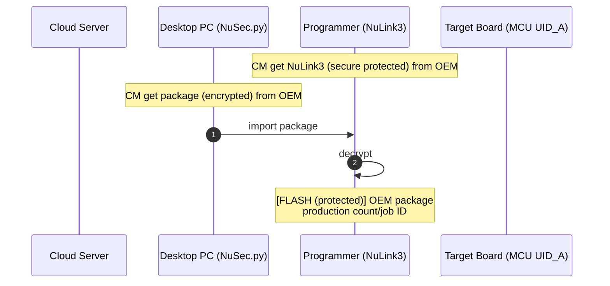

---
hide:
  - toc
---

# Import Package

```mermaid
sequenceDiagram
    autonumber
	participant c as Cloud Server
	participant d as Desktop PC (NuSec.py)
	participant a as Programmer (NuLink3)
	participant t as Target Board (MCU UID_A)
    note over a: CM get NuLink3 (secure protected) from OEM
    note over d: CM get package (encrypted) from OEM
    d ->> a: import package
    a ->> a: decrypt
    note over a: [FLASH (protected)] OEM package <br/>production count/job ID
```