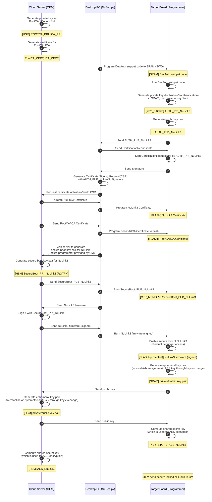

---
hide:
  - toc
---

# Prepare programmer

```mermaid
sequenceDiagram
    autonumber
	participant c as Cloud Server (OEM)
	participant d as Desktop PC (NuSec.py)
	participant t as Target Board (Programmer)

    %% Create a CA
    c ->> c: Generate private key for <br/>RootCA, ICA in HSM
    Note over c: [HSM] ROOTCA_PRI, ICA_PRI
    c ->> c: Generate certificate for <br/> RootCA, ICA 
    Note over c: RootCA_CERT, ICA_CERT
    
    %% Key generation & Certificate provisioning
    d ->> t: Program DevAuth snippet code to SRAM (SWD)
    Note over t: [SRAM] DevAuth snippet code
    t ->> t: Run DevAuth snippet code
    t ->> t: Generate private key (for NuLink3 authentication)<br/> in SRAM, then save to KeyStore
    Note over t: [KEY_STORE] AUTH_PRI_NuLink3
    t ->> t: Generate public key pair
    Note over t: AUTH_PUB_NuLink3
    t ->> d: Send AUTH_PUB_NuLink3
    d ->> t: Send CertificationRequestInfo
    t ->> t: Sign CertificationRequestInfo by AUTH_PRI_NuLink3
    t ->> d: Send Signature
    d ->> d: Generate Certificate Signing Request(CSR) <br/>with AUTH_PUB_NuLink3, Signature
    d ->> c: Request certificate of NuLink3 with CSR
    c ->> d: Create NuLink3 Certificate
    d ->> t: Program NuLink3 Certificate
    %% {TODO} Note over t: [OTP_MEMORY] NuLink3 Certificate (HASH)
    Note over t: [FLASH] NuLink3 Certificate
    c ->> d: Send RootCA/ICA Certificate
    d ->> t: Program RootCA/ICA Certificate to flash
    %% {TODO} Note over t: [OTP_MEMORY] RootCA/ICA Certificate (HASH)
    Note over t: [FLASH] RootCA/ICA Certificate

    d ->> c: Ask server to generate<br/>secure boot key pair for NuLink3 <br/>(Secure programmer provided by CM) 
    c ->> c: Generate secure boot key pair for NuLink3
    Note over c: [HSM] SecureBoot_PRI_NuLink3 (ROTPK)
    c ->> d: Send SecureBoot_PUB_NuLink3
    d ->> t: Burn SecureBoot_PUB_NuLink3
    Note over t: [OTP_MEMORY] SecureBoot_PUB_NuLink3
    d ->> c: Send NuLink3 firmware
    c ->> c: Sign it with SecureBoot_PRI_NuLink3
    c ->> d: Send NuLink3 firmware (signed)
    d ->> t: Burn NuLink3 firmware (signed)
    t ->> t: Enable secure lock of NuLink3 <br/>(Restrict debugger access)
    Note over t: [FLASH (protected)] NuLink3 firmware (signed)
    
    %%ECDH
    t ->> t: Generate ephemeral key pair <br/>(to establish an symmetric AES key through key exchange)
    Note over t: [SRAM] private/public key pair
    t ->> c: Send public key
    c ->> c: Generate ephemeral key pair <br/>(to establish an symmetric AES key through key exchange)
    Note over c: [HSM] private/public key pair
    c ->> t: Send public key
    t ->> t: Compute shared secret key <br/>(which is used for AES decryption)
    Note over t: [KEY_STORE] AES_NuLink3
    c ->> c: Compute shared secret key <br/>(which is used for AES encryption)
    Note over c: [HSM] AES_NuLink3

    Note over t: OEM send secure locked NuLink3 to CM
```